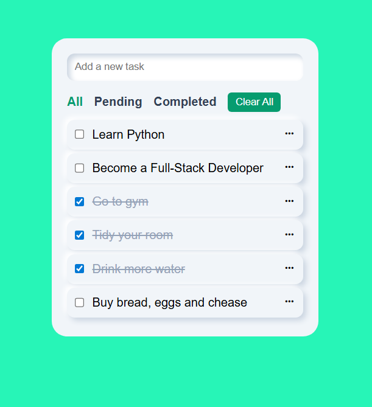

# 📝 To-Do List App

---

## 📋 Table of Contents
- 🏷️ [Introduction](#introduction)
- 💻 [Live Demo](#live-demo)
- 📷 [Screenshots](#screenshots)
- ✨ [Features](#features)
- 🛠️ [Technologies](#technologies)
- 🗂️ [Project structure](#project-structure)
- 💾 [Installation](#installation)
- ⚠️ [Notes](#notes)
- 🛣️ [Road Map](#road-map)
- 🫱🏻‍🫲🏼 [Contributing](#contributing)
- 📜 [License](#license)
- 👨🏻‍💻 [Author](#author--acknowledgments--contact) / 🙏🏻 [Acknowledgments](#author--acknowledgments--contact) / 📩 [Contact](#author--acknowledgments--contact)
- 💰 [Support Me!](#if-you-want-to-support-me)

---

## Introduction
A simple, responsive to-do list web application built using **HTML**, **CSS**, and **Vanilla JavaScript**. Tasks can be added, edited, marked as completed, filtered, and deleted — all in the browser with no dependencies.
<!-- ## Badges -->

---

## Live Demo
[⛓️‍💥 Demo](https://web-to-do-list-azure.vercel.app/)

---

## Screenshots
<p align="center">
  
</p>

---

## Features
- Add new tasks
- Mark tasks as completed or pending
- Edit and delete individual tasks
- Filter tasks by All / Pending / Completed
- Clear all tasks with one button
- Responsive UI and clean design
- No external libraries used except for icons (Boxicons)

---

## Technologies
- HTML5
- CSS3
- Vanilla JavaScript

---

## Project Structure
- │ 🗂️ to-do list app/
- ├── index.html
- ├── style.css
- ├── script.js
- ├── screenshots/
- │   └── to-do-list.png
- ├── .gitignore
- ├── LICENSE
- └── README.md

---

## Installation
1. Clone the repository:
```bash
git clone https://github.com/xAndreiix/Web_To_Do_List.git
cd todo-list
```
2. Open index.html in any modern browser. That’s it. No build step or server needed.
<!-- ## Usage -->
<!-- ## Configuration -->
<!-- ## Runing tests -->
<!-- ## Deployment -->

---

## Notes
- All task state is stored in memory (no localStorage or backend yet).
- Tasks reset when the page is refreshed.
- Boxicons CDN is used for edit/delete icons.

---

## Road Map
- Persist tasks in localStorage
- Add due dates, categories, or priorities
- Enable drag-and-drop reordering
- Add animations or sound feedback
<!-- ## FAQ -->

---

## Contributing
Pull requests are welcome.
For major changes, please open an issue first to discuss what you’d like to change.
<!-- ## Changelog -->

---

## License
This project is licensed under the MIT License - see the [LICENSE](LICENSE)

---

## Author / Acknowledgments / Contact
**Author:** 
Andrei Iliescu

[](https://xandreiix.github.io/Andrei-Iliescu-Portfolio/)

**Acknowledgments:**  
- Inspired by [@i.code4u](https://www.tiktok.com/@i.code4u) tutorial on TikTok.

[](https://www.tiktok.com/@i.code4u/photo/7527571365814177046?is_from_webapp=1&sender_device=pc&web_id=7403075142698436128)
- All thanks to him for the tutorial!

**Contact:**  

[](https://linkedin.com/in/andrei-iliescu-aa7910214)<br>
[](mailto:andrey_iliescu@yahoo.com)<br>
[](mailto:andrei.iliescu13102000@gmail.com)
